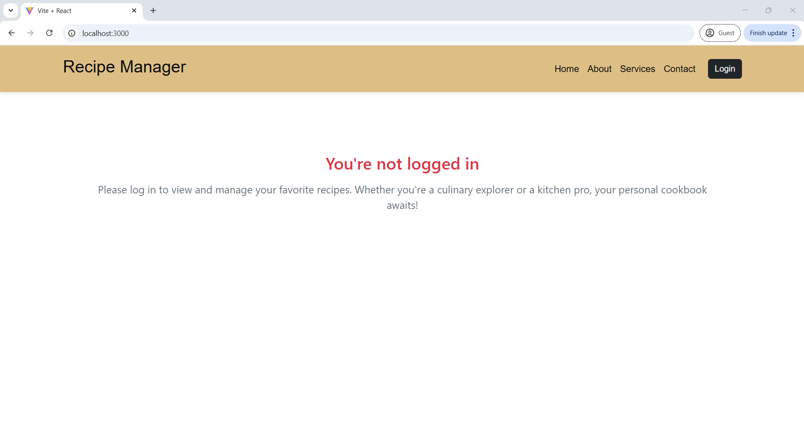
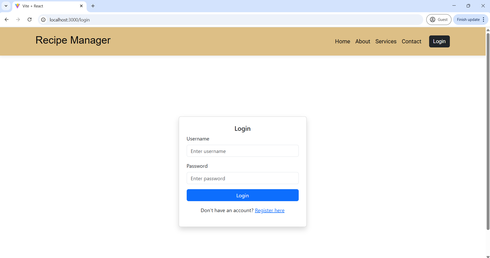
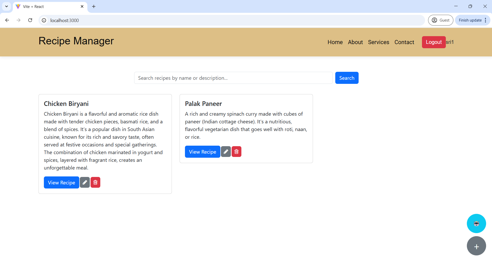
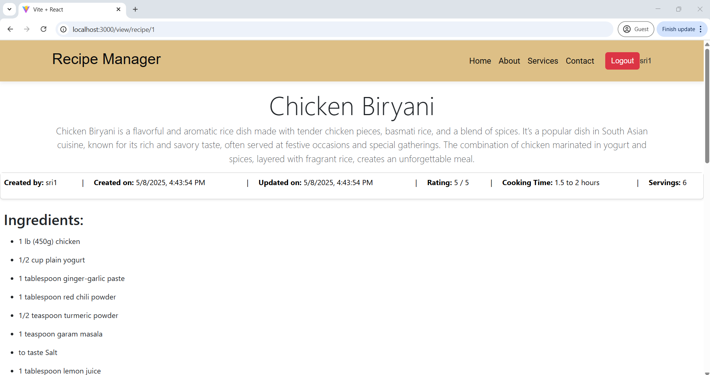
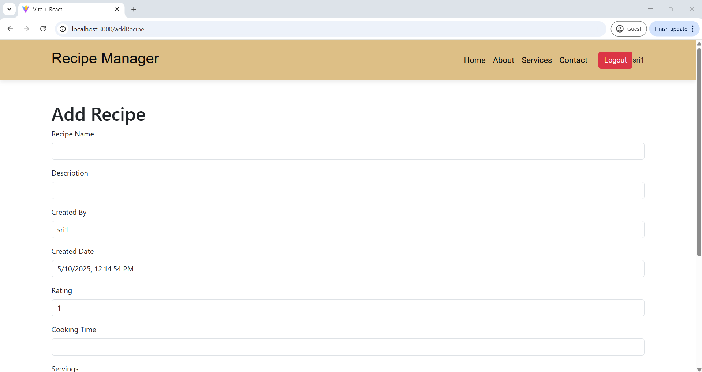
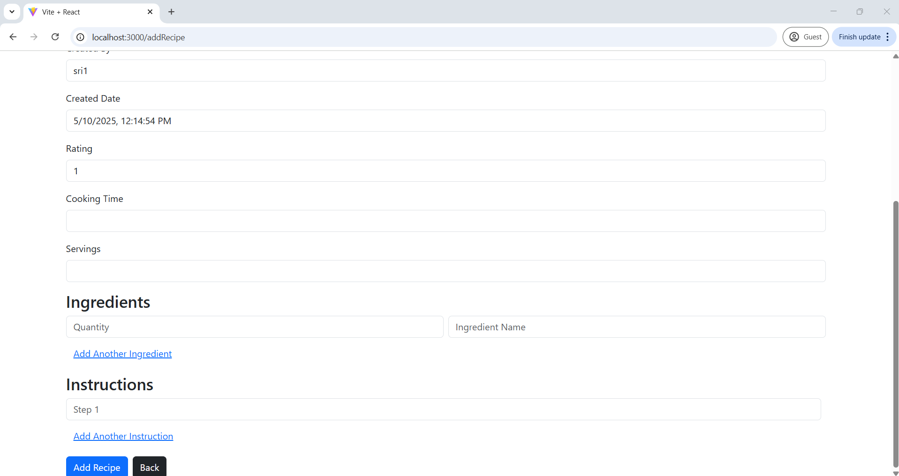
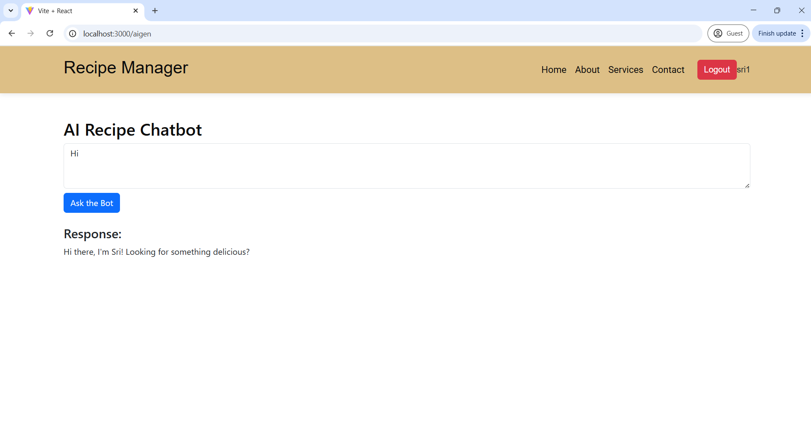
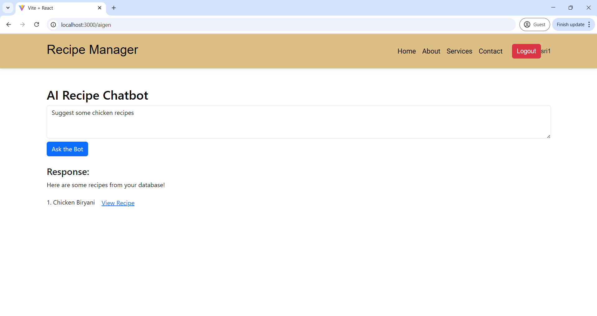
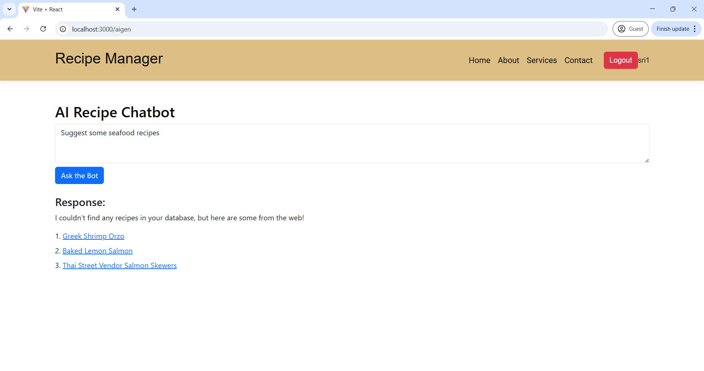

# 🍽️ Recipe Management System

A comprehensive full-stack web application that enables users to create, manage, and explore a variety of recipes. Built with **Spring Boot** (Java) for the backend and **React.js** for the frontend, this system offers features like user authentication, recipe creation, editing, deletion, and AI-powered recipe suggestions.

---

## 📚 Table of Contents

- [📌 Introduction](#-introduction)
- [🧰 Technologies Used](#-technologies-used)
- [⚙️ Project Setup Instructions](#-project-setup-instructions)
  - [I. Prerequisites](#i-prerequisites)
  - [II. Clone the Repository](#ii-clone-the-repository)
  - [III. Backend Setup](#iii-backend-setup)
  - [IV. Frontend Setup](#iv-frontend-setup)
- [📸 Screenshots](#-screenshots)
- [📄 License](#-license)
- [🤝 Contributions](#-contributions)

---
## 📌 Introduction

The Recipe Management System is a full-stack web application that enables users to create, manage, and explore a wide variety of cooking recipes through an intuitive and user-friendly interface. Built using a microservice architecture, it features a React-based frontend and a Spring Boot backend, along with a Python-powered service for handling natural language queries. The application supports secure user authentication, personalized recipe storage, and seamless interaction through a smart chatbot interface. Additionally, it integrates with external APIs to enhance recipe suggestions and provide a dynamic, modern cooking assistant experience.

 ### Key Features :

 - **Authentication System:** Designed a secure login and registration flow using **JWT tokens** within a **Spring Boot microservice architecture**.

 - **Recipe CRUD Operations:** Implemented full **Create, Read, Update, and Delete (CRUD)** functionality for user-specific recipes using **Spring Boot**, **REST APIs**, and a **MySQL database**.

 - **Frontend (React):** Built a responsive **React** user interface styled with **Bootstrap**, allowing users to easily search, view, and manage recipes.

 - **JWT-Based Personalization:** Linked recipes to individual authenticated users using **JWT**, enabling a **personalized cooking experience**.

 - **Microservices Communication:** Enabled seamless interaction between the **Flask AI microservice** and **Java-based recipe backend** using **RESTful APIs**. 

 - **Feign Client Integration:** Used **Feign Client** to enable seamless interaction between the **Recipe** and **Authentication microservices** for secure user validation and recipe personalization.

 - **AI Chatbot Integration:** Integrated a **Flask-based AI chatbot** using **spaCy PhraseMatcher** to understand user queries and provide recipe suggestions. 

 - **Spoonacular API Support:** Added intelligent recipe fallback support using the **Spoonacular API** when user-specific data is not available.

 - **Small Talk + Smart Prompts:** AI bot responds to greetings, handles suggestions, and provides fallback responses using intuitive prompt flows.

### Key Components & Functionality :

- ### Authentication UI
  * Handles **user login and registration**.
  * On successful login, **JWT token** is stored in `localStorage` for subsequent requests.
  * Displays different UI states based on login status (e.g., access to recipe features only when logged in).

- ### Recipe Listing and Search
   * Fetches user-specific recipes using their JWT token.
   * Provides **search functionality** to filter recipes by name or description.
   * Supports **view, edit, and delete** actions for each recipe with REST API integration.

- ### Add/Edit Recipe
   * React forms are used to submit recipe data (name, description, ingredients, instructions, etc.).
   * Sends data to the backend via `axios` POST/PUT requests.
   * Recipes are tied to the logged-in user via token-based personalization.

- ### AI Chatbot Integration
   * An **AI Recipe Bot** UI allows users to ask recipe-related questions (e.g., "suggest something with paneer").
   * Sends the user’s query and token to the **Flask-based AI microservice**, which returns recipe suggestions.
   * Suggestions are displayed with links to view the detailed recipe.

- ### Routing and Navigation
   * Uses `react-router-dom` to handle navigation (e.g., `/addRecipe`, `/edit/recipe/:id`, `/view/recipe/:id`, `/aigen`).
   * Ensures that protected routes redirect unauthenticated users.

- ### UI/UX Features
   * Uses **Bootstrap components** for styling and layout (cards, buttons, inputs, forms).
   * Includes user-friendly messages and fallback views when not logged in or when no recipes are found.
   * Floating "+" button to easily add a new recipe, styled with rounded design.


## 🧰 Technologies Used

- ### Backend (Java + Spring Boot)
  * Spring Boot (REST APIs), Spring Security with JWT Authentication, Hibernate + JPA, Lombok

- ### Backend (Python)
   * Flask, spaCy, Spoonacular API

- ### Frontend (React)
   * React.js (SPA), React Bootstrap, Axios (API integration), React Router

- ### Database
   * MySQL Database

- ### Testing Frameworks
   * JUnit, Mockito

- ### Development Tools
   * Vite, npm, Postman, IntelliJ, Git

---

## ⚙️ Project Setup Instructions

## I. Prerequisites

Before running the project, ensure that the following tools and dependencies are installed on your machine:

   - **Git** (for cloning the repository) - [Installl Git](https://git-scm.com/downloads)
   - **Java** (for running the Spring Boot backend) - [Install Java](https://www.oracle.com/java/technologies/javase-jdk11-downloads.html)
   - **Maven** (for building the Spring Boot backend) - [Install Maven](https://maven.apache.org/install.html)
   - **Node.js** (for running the React frontend) - [Install Node.js](https://nodejs.org/en/download/)
   - **Python** (for running the AI chatbot service) - [Install Python](https://www.python.org/downloads/)
   - **MySQL** (for the database) - [Install MySQL](https://dev.mysql.com/downloads/installer/)
   - **Spoonacular API** (for AI Gen, Create API Key) - [Spoonacular API](https://api.spoonacular.com/recipes/complexSearch)
   - **Postman or any API testing tool** (for testing the API calls) - [Install Postman](https://www.postman.com/)

### II. Clone the Repository

   Open your terminal or Git Bash and clone the repository:

   ```bash
   git clone https://github.com/SrinivasuluDuggampudi/RecipeManagementSystem.git
   ```

## III. Backend Setup

* ### Spring Boot (Java) Backend

   1. **Navigate to the backend directory after git clone and import this project using IntelliJ and make sure JDK path is added in Environmental Variables**:

   ```bash
   cd /RecipeManagementSystem/RecipeBackEnd
   ```

   2. **Install dependencies using Maven** (you may need Maven installed on your machine):

   ```bash
   mvn clean install
   ```

   3. **Configure the database**:  
      - Create a MySQL database Workspace and create tables as per Recipe_Scripts.sql File which is present in RecipeBackEnd and update the database configurations in `application.properties` (found in `src/main/resources`) accordingly.
      - Make sure to configure your `username`, `password`, and `URL` for your MySQL database.

   4. **Run both the Microservices (RecipeManagerApplication and AuthApplication)**:

   ```bash
   mvn spring-boot:run
   ```

   5. Once the backend is running, Recipe Service available on `http://localhost:8080` and Auth Service will be available on `http://localhost:8082`.

* ### Python-based Chatbot Service (Flask)

   1. **Navigate to the chatbot directory**:

   ```bash
   cd ../RecipeManagementSystem/RecipeBackEnd/Python_Backend
   ```

   2. **Install required Python dependencies**:

   ```bash
   pip install -r requirements.txt
   pip install flask spacy requests flask-cors
   pip install numpy --prefer-binary
   pip install spacy --prefer-binary
   pip install flask-cors
   python -m spacy download en_core_web_sm
   ```

   3. **Run the Flask app using CMD Terminal or Git Bash**:

   ```bash
   python Recipebot.py
   ```

   4. This will start the AI chatbot service on `http://localhost:5000`.

## IV. Frontend Setup

   i. **Navigate to the frontend directory**:

   ```bash
   cd ../RecipeManagementSystem/RecipeFrontEnd
   ```

   ii. **Install the required Node.js dependencies**:

   ```bash
   npm install
   ```

   iii. **Start the React development server**:

   - Navigate to the frontend directory:
      ```bash
      cd RecipeFrontEnd/recipe-manager
      ```
   - ByPass Policies if asks:
      ```bash
      Set-ExecutionPolicy -Scope Process -ExecutionPolicy Bypass
      ```   
   - Start the React development server:
      ```bash
      npm run dev
      ```

   iv. The frontend will now be available at `http://localhost:3000` in your web browser.

---

## 📸 Screenshots

- ### Landing Page


- ### Login Page


- ### Dashboard


- ### View Recipe


- ### Add Recipe S1


- ### Add Recipe S2


- ### AI Chatbot S1 


- ### AI Chatbot S2


- ### AI Chatbot S3 



---
---
## 📄 License

This project is licensed under the [MIT License](https://opensource.org/licenses/MIT).  
You are free to use, modify, and distribute this software with proper attribution.

---
---
## 🤝 Contributions

Contributions are welcome!  
If you’d like to improve this project, feel free to fork the repository and submit a pull request.

Before contributing:
- Make sure your code is well-documented
- Follow the existing code style
- Test your changes thoroughly

For major changes, please open an issue first to discuss what you'd like to change.

---
